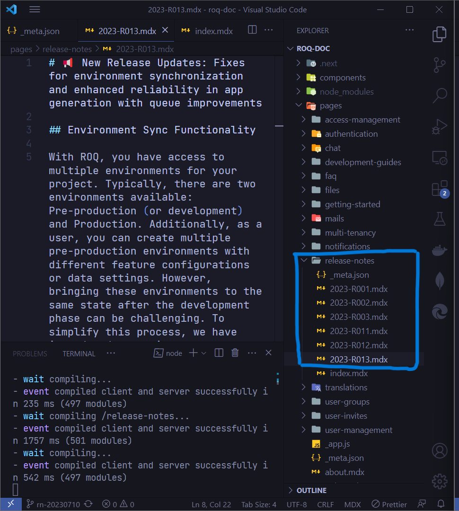

# How To Make A Release Note Page

## Fork or Clone The Documentation Repo

```sh
git clone https://github.com/roqtech/documentation.git
```

Then install all the project dependencies

```sh
cd documentation
npm install
```

The dev version of the documentation will be run on `http://localhost:3000`.

## Make a branch

```sh
git branch release-note-2023-07-10
```

You can change the branch name **release-note-2023-07-10** to anything.

## Make A Release Page

There are a few steps to make a release page: 

### 1. Create A File `release-note-name-change-this.mdx`
Go to this directory `/pages/release-notes` and make a release page file and make sure the file have `.mdx` extension.



 For example the file name is `2023-R013.mdx`.

> The documentation is basically written in a [Markdown](https://www.markdownguide.org/) format.

Add any changes in the release page file you have created, that is `2023-R013.mdx`.

### 2. Register The File in the `_meta.json`

Edit file `_meta.json` and add the `2023-R013.mdx` to the top (if you want it to be shown on the top menu) AFTER this ` "index": "Overview",` and don't forget the comma `,`

```js
{
  "index": "Overview",
  "2023-R013": "2023-07-10",
  "2023-R012": "2023-07-07",
  "2023-R011": "2023-06-13",
  "2023-R003": "2023-04-06",
  "2023-R002": "2023-03-29",
  "2023-R001": "2023-03-24"
}

```

### 3. Include Release Page Link in the `index.mdx`

Edit file `index.mdx` in the same directory with the new release page.

```ts
import { Tab, Tabs } from 'nextra-theme-docs';
import { Callout } from 'nextra-theme-docs';
import Image from 'next/image';

# ROQ Release Log

| Release highlights                                                       | Date       |
|--------------------------------------------------------------------------|------------|

| [Demo Data in Generated Apps, Pre-Flight Check & UI Enhancements!](/release-notes/2023-R012) | 2023/07/07 |     
| [Project Access Management ](/release-notes/2023-R011)                   | 2023/06/13 |     
| [Webhooks and other improvements ](/release-notes/2023-R003)             | 2023/06/06 |     
| [Jupiter instance of ROQ Platform](/release-notes/2023-R002)             | 2023/03/29 |     
| [Authenticaton and multi-tenancy improvements](/release-notes/2023-R001) | 2023/06/24 |

```

Add this code to the top after `| ----- | -----|`

```md
| [Fixes for environment synchronization and enhanced reliability in app generation with queue improvements](/release-notes/2023-R013) | 2023/07/10 |     

```

Just make sure the link point to the right release page filename
`/release-notes/2023-R013` (do not include `.mdx` extension).

The final file content will be like this

```ts
import { Tab, Tabs } from 'nextra-theme-docs';
import { Callout } from 'nextra-theme-docs';
import Image from 'next/image';

# ROQ Release Log

| Release highlights                                                       | Date       |
|--------------------------------------------------------------------------|------------|
| [Fixes for environment synchronization and enhanced reliability in app generation with queue improvements](/release-notes/2023-R013) | 2023/07/10 |     
| [Demo Data in Generated Apps, Pre-Flight Check & UI Enhancements!](/release-notes/2023-R012) | 2023/07/07 |     
| [Project Access Management ](/release-notes/2023-R011)                   | 2023/06/13 |     
| [Webhooks and other improvements ](/release-notes/2023-R003)             | 2023/06/06 |     
| [Jupiter instance of ROQ Platform](/release-notes/2023-R002)             | 2023/03/29 |     
| [Authenticaton and multi-tenancy improvements](/release-notes/2023-R001) | 2023/06/24 |
```

### 4. Commit The Changes

Commit the changes into your cloned repository. If you are using git command line run `git status`

you will see something like this

```sh
Changes not staged for commit:
  (use "git add <file>..." to update what will be committed)
  (use "git restore <file>..." to discard changes in working directory)
        modified:   release-notes/_meta.json
        modified:   release-notes/index.mdx

Untracked files:
  (use "git add <file>..." to include in what will be committed)
        images/2023-R013.mdx

```

you need to add the necessary files only. use `git add <file>`

```sh
git add release-notes/_meta.json release-notes/index.mdx images/2023-R013.mdx
```

> note: you can add file one by one or just on line `git add filename1 filename2 filename3`

Make sure the changes added to the repository, run this command again

```sh
git status
```

If there are no more untracked files left then you can commit it

```sh
git commit -m "your_commit_message_is_here"
```

> note: make the commit short

### 5. Make A Pull Request

After commit a changes you can make a Pull Request (PR) to the ROQ documentation GitHub repo.

Update your remote branch by using this command

```sh
git push
```

Go to the GitHub there will be a big green button with text **Compare & pull request**. Click that button,


then it will bring you to the **Open Pull Request** page.


Write a custom title if you have to and any necessary reasons behind this pull request.


